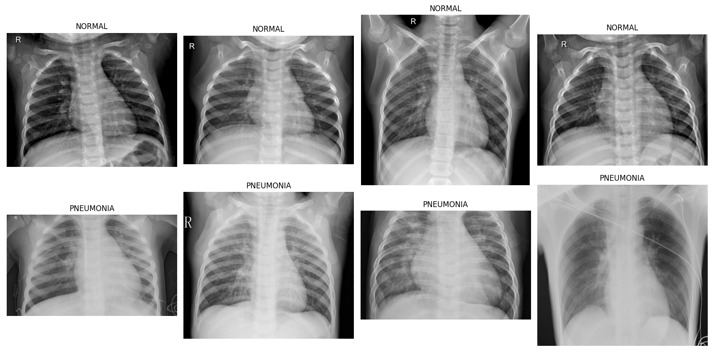
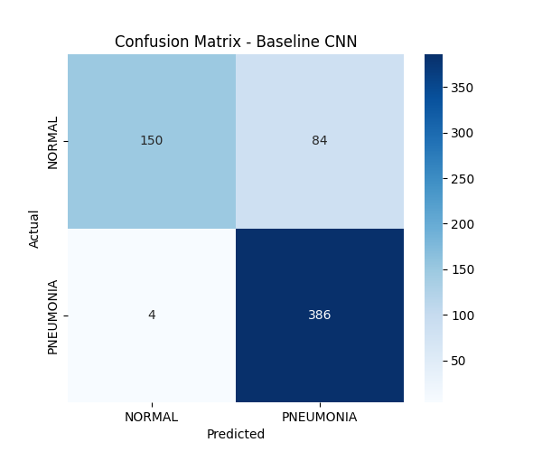
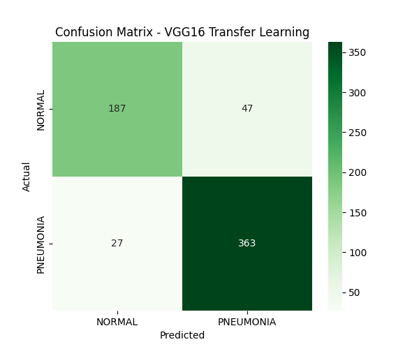
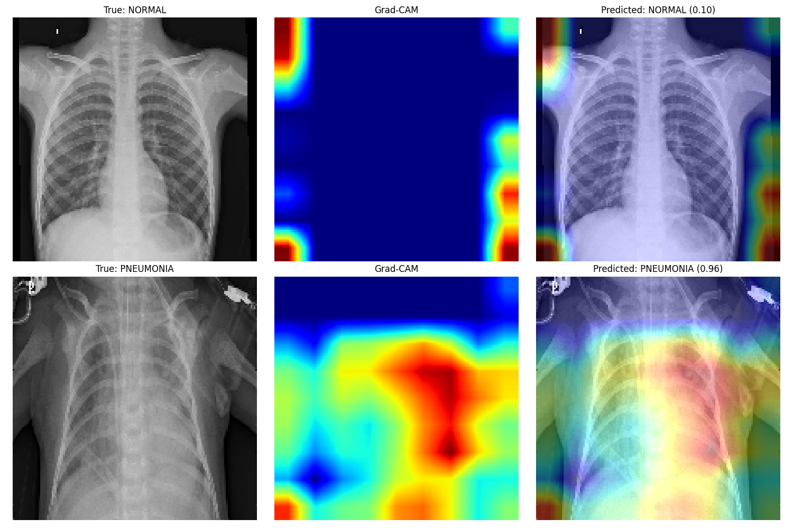

# Pneumonia Detection from Chest X-Rays using CNN and Transfer Learning (VGG16)

An end-to-end deep learning project that classifies chest X-rays as Normal or Pneumonia, comparing a custom CNN trained from scratch against a VGG16 transfer learning model, with Grad-CAM added for explainability.

## Project Overview

This project explores two approaches to medical image classification and demonstrates why overall accuracy alone is insufficient for evaluating models in healthcare contexts — recall, precision, and error type distribution matter significantly more.

## Dataset

- **Source:** [Chest X-Ray Images (Pneumonia)](https://www.kaggle.com/datasets/paultimothymooney/chest-xray-pneumonia) - Kaggle (Paul Mooney)
- **Size:** 5,856 chest X-ray images
- **Classes:** Normal, Pneumonia
- **Split:** Train / Validation / Test (validation set was re-derived from training data due to an insufficient official validation split)

### Sample X-Ray Images



## Methodology

### Data Preprocessing
- Images resized to 150x150
- Pixel normalization (rescale 1./255)
- Augmentation: rotation, width/height shift, zoom
- Horizontal flip deliberately **excluded** — anatomical orientation is medically meaningful and should not be mirrored
- Class weights computed to address class imbalance (Pneumonia images outnumber Normal images in the training set)

### Approach 1: Custom CNN (Baseline)
- 4-block architecture: Conv2D + MaxPooling, increasing filter depth (32 → 64 → 128 → 128)
- Dropout (0.5) for regularization
- Trained from scratch, no pretrained weights

### Approach 2: Transfer Learning (VGG16)
- VGG16 pretrained on ImageNet, base layers frozen
- Custom classification head: GlobalAveragePooling2D → Dense(128) → Dropout(0.5) → Dense(1, sigmoid)
- Only ~65K parameters trained (out of 14.78M total)

### Explainability: Grad-CAM
- Gradient-weighted Class Activation Mapping applied to the VGG16 model
- Visualizes which image regions influenced each prediction
- Used to verify the model focuses on lung regions, not background artifacts

## Results

| Metric | Baseline CNN | VGG16 Transfer Learning |
|---|---|---|
| Test Accuracy | 87% | 88% |
| Normal — Precision | 0.97 | 0.87 |
| Normal — Recall | 0.66 | 0.80 |
| Pneumonia — Precision | 0.83 | 0.89 |
| Pneumonia — Recall | 0.99 | 0.93 |
| Macro F1 | 0.85 | 0.87 |

**Key Finding:** The baseline CNN prioritized catching nearly every Pneumonia case (99% recall) but over-predicted Pneumonia overall, resulting in poor Normal-case recall (66%). VGG16 transfer learning produced a more balanced outcome across both classes, trading a small amount of Pneumonia sensitivity for significantly fewer false alarms on healthy X-rays.

### Confusion Matrices

| Baseline CNN | VGG16 Transfer Learning |
|---|---|
|  |  |

## Grad-CAM Visualization

Grad-CAM heatmaps confirmed the model's attention concentrates on lung regions for both Normal and Pneumonia cases, supporting confidence in the model's decision-making process rather than reliance on irrelevant image artifacts.



## Tech Stack

- Python
- TensorFlow / Keras
- VGG16 (ImageNet pretrained)
- Grad-CAM
- scikit-learn
- Matplotlib, Seaborn
- Google Colab (GPU)

## Project Structure

```
├── PNEUMONIADETECTIONCNN.ipynb     # Main notebook (data prep, training, evaluation, Grad-CAM)
├── README.md                       # Project documentation
├── baseline_cnn_pneumonia.h5       # Saved baseline CNN model weights
├── confusion_matrix_baseline.png   # Confusion matrix - Baseline CNN
├── confusion_matrix_vgg16.png      # Confusion matrix - VGG16 Transfer Learning
├── gradcam_comparison.png          # Grad-CAM visualization (Normal vs Pneumonia)
└── sample_xrays.png                # Sample dataset images
```

## Key Takeaways

- Overall accuracy can mask significantly different model behavior — recall and precision per class reveal the real tradeoffs
- Transfer learning offers a strong, balanced starting point on smaller specialized datasets, even with all base layers frozen
- Explainability tools like Grad-CAM are essential before any model in a healthcare-adjacent domain could be considered trustworthy for real-world use

## Author

**Shibila Sherin M**
Data Science | Data Analysis | Power BI | Python | Statistics | Machine Learning | NLP | Deep Learning | SQL

[](https://www.linkedin.com/in/shibilasherinn)
[](https://github.com/shibilasherinn/E-Commerce-Sales-Dashboard)
